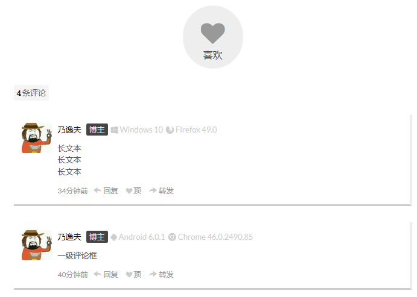
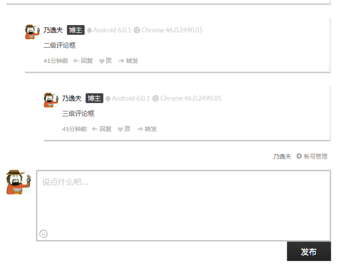

# duoshuo-theme-next

与Hexo的NexT主题契合的多说css样式，扁平化，简洁

未缩进的是在原版基础上增添的或改进过的代码

用过的大佬们给个星星吼不吼哇ヽ(•̀ω•́ )ゝ

## 效果预览

- 
  ​      		   

- 实用效果查看：[乃逸夫的博客](http://lnaif.github.io/2016/duoshuo-theme-next/#more)

## 用法

- `\next\source\css\_common\components\third-party`,找到`duoshuo.styl`文件，这个就是控制**多说评论版块样式**的css文件，可以直接替换。
- 或者直接在**多说官网**的开发者中心中添加**css**，但并不推荐这种方式，因为在多说官网上修改的css很容易被本地的`.styl`覆盖。

## 许可

开源共享，禁止商用
